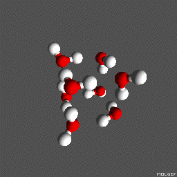
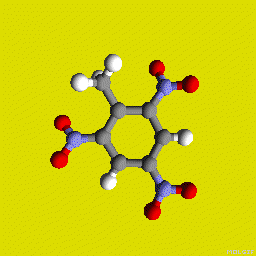
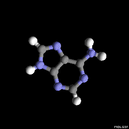
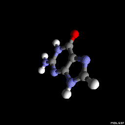

#Molgif

Molgif is an easy-to-use tool for creating
[GIF](https://en.wikipedia.org/wiki/GIF) animations of molecules. Thanks to the
widespread support of [GIF](https://en.wikipedia.org/wiki/GIF) file format,
animations can be easily embedded into presentations, websites, wikipedia, and
so forth.

###Installation

Molgif works on Linux, BSD, OSX, Windows operating systems. Molgif requires
[Go](https://golang.org) version 1.5 or later. To compile, change into the
directory with molgif source code and type:

    go build

Molgif has no external dependencies and uses only [Go](https://golang.org)
standard library. Animation rendering is performed using ray-tracing. Rendering
is done in parallel using multiple CPUs available on the system.

###Usage examples

To see the list of available command line flags with documentation, type:

    molgif -help

Below is a list of sample animations along with the molgif command used to
create them.

######Caffeine molecule

    molgif caffeine.xyz

######Benzene molecule

    molgif -X -t 3 -a 0.2 benzene.xyz

######Carbon nanotube

    molgif -w 500 -t 5 nanotube.xyz

######Water molecule

    molgif -Y -t 5 -r 80 -g 80 -b 80 water.xyz

######TNT molecule

    molgif -r 220 -g 220 tnt.xyz

######Fullerene molecule

    molgif -Y -t 8 -g 100 -b 100 -a 0.3 fullerene.xyz

######Adenine and Guanine nucleobases

    molgif -t 8 adenine.xyz
    molgif guanine.xyz

